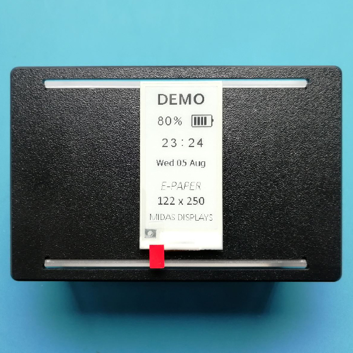

# E-Paper Demo
This is a demo project for a monochrome 2.13" E-Paper display using an Adafruit Pro Trinket 3V (ATmega328p) microcontroller.
The demo emulates an application with date, time and battery indication.

### Parts used:
- [MDE0213A122250BW][0]      (E-Paper display  --  buy from [Farnell][1]) 
- [Adafruit Pro Trinket 3V - 12MHz][2]     (microcontroller from Adafruit)
- [MDIB-EP1](https://www.midasdisplays.com/product-explorer/accessories/e-paper-driver-solutions/mdib-ep1)     (adaptor board -- to buy contact <sales@midasdisplays.com>)
- Wires

*See also -> <https://github.com/midas-displays>*

[0]: <https://www.farnell.com/datasheets/2822932.pdf>
[1]: <https://uk.farnell.com/midas/mde0213a122250bw/e-paper-display-122-x-250-pixels/dp/3154926> "MDE0213A122250BW from Midas Displays"
[2]: <https://www.adafruit.com/product/2010> "Adafruit Pro Trinket 3V - 12MHz"
